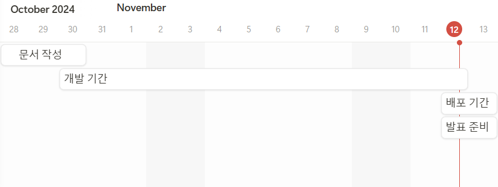

# 🐧 ㄴㄹㅁㅆㅁ (초성 퀴즈 커뮤니티)

한글 초성 퀴즈를 서로 공유 할 수 있는 커뮤니티 플랫폼입니다.

### 프로젝트 소개

사용자들이 주제 별로 초성 퀴즈를 직접 만들고, 다른 유저들이 문제를 풀어가며 즐기는 게임 커뮤니티 사이트입니다.  
초성으로만 이루어진 단어나 문장을 맞추는 과정에서 언어 감각을 키울 수 있는 공간을 제공합니다. 

#### 👀 주요기능

* 주제 별 초성 퀴즈 생성
* 퀴즈 정답 시 점수 획득 또는 차감
* 점수에 따른 랭킹 시스템
* 커뮤니티 기능

 

#### 서비스 링크

* https://

 

## ⏲️ 개발 기간

* 2024년 10월 28일 ~ 11월 13일
  

 

## 💻 개발환경

- IDE : IntelliJ
- Frontend : Bootstrap, JavaScript
- Language : Java 17
- Framework : SpringBoot 3.3.5
- Database : MySQL
- ORM : JPA
- 배포 환경 : AWS EC2, RDS
- 협업 도구 : Notion, GitHub, ERD Cloud, Figma

 

## ⭐ 기능 정의서 (요구사항 명세)

<텍스트 혹은 이미지>

 

## 💫 화면 설계서

<피그마 첨부 가능>

 

## ⚙️ 시스템 구성도 (System Structure)

출처: draw.io 메인 페이지(https://www.drawio.com/)

 

## ⚙️ ERD 설계도

출처: ERD 샘플 (https://www.erdcloud.com/d/A8SPzXyvcxr6WAZBv)

 

## 🎈API 명세서

 

## 🎞시연 영상

 

## 👨‍💻 멤버 구성 및 역할

- 프로젝트 매니저 (PM) : 팀 회의 주관, 프로젝트 진행 상황 보고, 문제 발생 시 해결책 모색 및 조율
- 프론트엔드 개발자 : React, Vue 등의 프레임워크를 활용한 화면 구성, 스타일링 및 애니메이션 구현, 사용자와의 상호작용 기능 개발
- 백엔드 개발자 : API 개발, 데이터 모델링, 사용자 인증 및 데이터 보호, 백엔드 코드 최적화 및 유지 보수
- 디자이너 : 프로토타입 제작, 사용자 피드백을 반영한 UI 개선, 디자인 시스템 구축, 프론트엔드와 협력하여 디자인 가이드라인 제공
- QA 엔지니어 : 테스트 케이스 작성, 오류 및 버그 탐지, 자동화 테스트 스크립트 작성, 최종 검수 및 품질 평가 보고서 작성

 

## 🛠 코딩 컨벤션

- Java Coding Convention
- 참고 https://www.notion.so/oreumi/202d0d0895884dd7847673fe7d40a0e0
